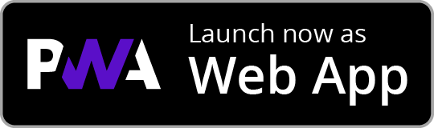

<p align="center"></p>

# QUANTOS

<a href="#">
  
</a>
<a href="#">
  
</a>
<a href="#">
  
</a>
<a href="#">
  
</a>
<a href="#">
  
</a>

Built with:

<a href="#">
  
</a>
<a href="#">
  
</a>
<a href="#">
  
</a>
<a href="#">
  
</a>
<a href="#">
  
</a>

## What is QUANTOS?

Progress is reaching a fascinating speed in today's world due to ever more powerful computers in development and research. Formerly buzzword technologies, such as AI and machine learning, are arriving in the middle of the working world - and the "next big thing" is already on the horizon: "Quantum computing" is the buzzword of the future, which has the potential to permanently change many work processes. Accordingly, it is important to familiarize yourself with it as early as possible. Too complicated? It doesn't have to be!

Quantos is a cooperation with the [Forschungszentrum Jülich](https://www.fz-juelich.de/en) - a beginner-friendly and WCAG 2.1 Level AA-accessible learning platform that enables a wide target group from middle school to workpersons to learn how quantum annealers function. The app design is based on gamification, delivering content in diverse ways with a mix of text blocks and interactive participatory tasks. Quantos runs natively on all major platforms, including mobile on Android and iOS, web, and desktop on Windows, macOS, and Linux. Making quantum physics as easy as brushing your teeth - you may not like doing it, but with the right approach, it can actually be fun!

Documentation: [QUANTOS Documentation](https://www.example.com) \
Project website: [Project site and blog](https://www.example.com)

## Installation

<div align="center">
  <a href="https://play.google.com/store/apps/details?id=de.xp4u1.discite">
    
  </a>
  <a href="https://apps.apple.com/app/id1566607319">
    
  </a>
  <a href="https://app.quantos.com">
    
  </a>
  <br>
  <a href="https://apps.microsoft.com/store/detail/dolby-access/9N0866FS04W8">
    
  </a>
  <a href="https://apps.apple.com/app/id1566607319">
    
  </a>
  <a href="https://example.com/">
    
  </a>
</div>

Follow the steps below to run Quantos on your machine locally (requires Flutter installation):

```
# Clone repo
$ git clone git@github.com:Totemi1324/Quantos

# Get packages
$ flutter pub get

# Start Dart DevTools:
$ dart devtools

# Run the app in debug mode
# Make sure to select your device (browser/emulator) before executing!
$ flutter run

# You should get an output with a security token, copy it!
An Observatory debugger and profiler on iPhone X is available
at: http://127.0.0.1:50976/Swm0bjIe0ks=/
```

Now, DevTools can be accessed at `localhost:9100` in the browser. Paste your token in the dialogue to connect the app.

## Supporters

<a href="https://www.fz-juelich.de/en/ias/jsc/systems/quantum-computing/juniq-facility">
  
</a>

## Screenshots